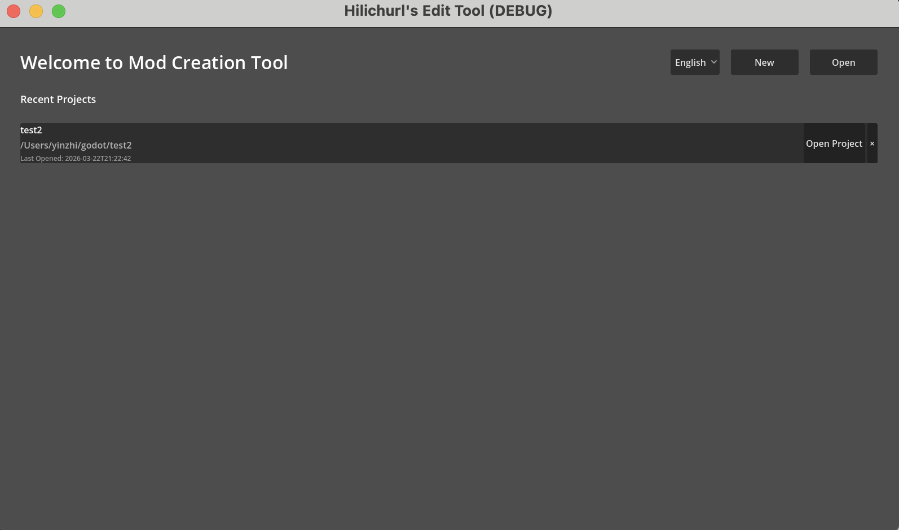
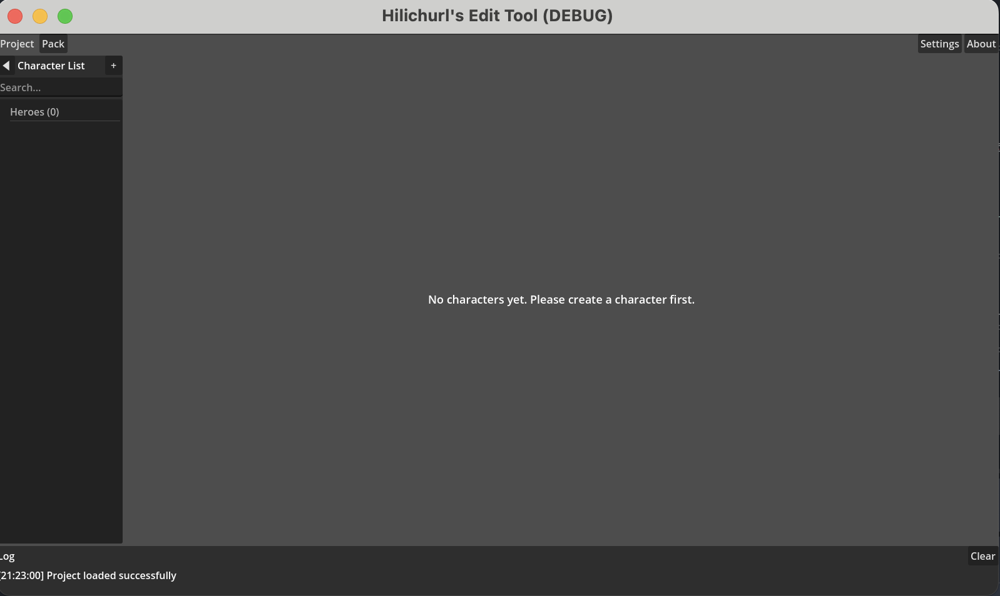

# 第一章：认识编辑器

## 这是什么？

一款简单的游戏 Mod 编辑器。目前支持新建英雄角色和编辑部分剧情事件。

编辑器仍在积极开发中，更多功能敬请期待。

## 能做什么？

- **英雄编辑** —— 配置角色的基本信息、战斗属性、资源、事件等
- **项目管理** —— 创建和管理多个独立项目，每个项目包含多个角色
- **导出打包** —— 将角色数据和资源打包为游戏可加载的格式

各功能的详细说明见[快速开始](02_quick_start.md)及后续章节。

## 整体工作流程

使用编辑器的典型流程如下：

```
准备阶段                    创作阶段                     发布阶段
───────                    ───────                     ───────
下载 options 配置    →     创建项目            →     导出打包
准备 mod 素材              添加角色                   选择打包模式
(立绘/CG/语音等)           编辑属性                   生成数据包
                           编排事件
                           导入素材
```

- **准备阶段**：下载 options 配置包，并准备好你要制作的 mod 素材（立绘、CG、语音等）。options 配置包提供编辑器所需的基础数据（英雄模板、物品列表、音效库等）。详见[基础数据来源](03_options_source.md)。
- **创作阶段**：这是日常使用的主要阶段。在编辑器中创建项目、添加角色、配置各项数据、导入你准备的素材。
- **发布阶段**：将完成的角色数据导出为游戏可识别的格式。详见[导出与打包](05_export.md)。

## 界面概览

编辑器有两个主要界面：

### 欢迎页



启动编辑器后首先看到的是欢迎页。这里展示你最近打开过的项目列表，你可以：

- 点击项目名称直接打开
- 创建新项目
- 打开已有项目文件夹
- 切换界面语言（中文 / English / 日本語）

首次启动时，编辑器会要求你配置两个路径：基础数据目录（options）和 Godot 可执行文件路径。这些设置之后可以在设置中修改。

### 主界面



进入项目后的主界面由三个区域组成：

- **左侧：角色侧边栏** —— 显示当前项目的所有角色，支持搜索和折叠
- **中央：编辑区** —— 包含多个标签页，根据当前编辑的角色类型显示对应的功能
- **底部：日志面板** —— 显示操作日志，帮助确认保存、导入等操作是否成功

顶部工具栏提供项目管理（新建/打开/关闭）、工具菜单、导出按钮和设置入口。

## 设计说明

**自动保存** —— 编辑器会在你修改数据后自动保存，不需要手动点击保存按钮。

**随资源配置** —— 事件类型、可选项列表等内容来自 options 配置包，更新配置包后编辑器即可自动适应。
