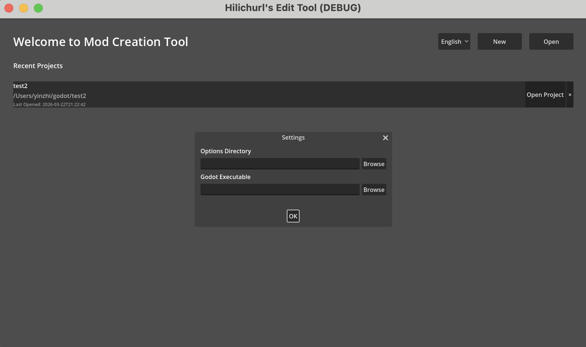
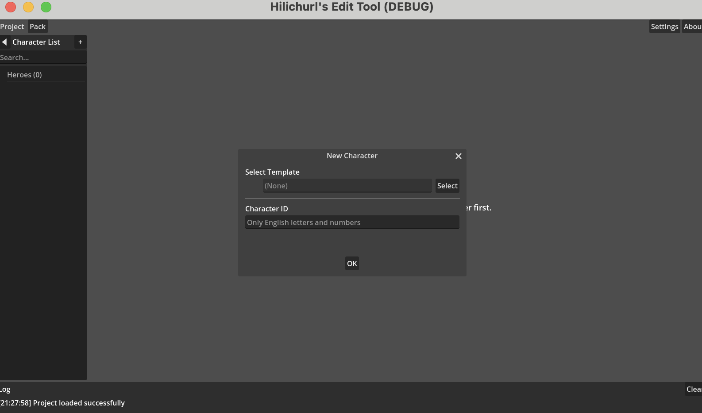

# 第2章：クイックスタート

## 初回起動

エディタを起動すると、ウェルカム画面が表示されます。初回利用時は設定ダイアログが自動で開き、2つのパスの設定を求められます。

- **Options ディレクトリ**（`editor.options_root`）— エディタの基礎データパッケージがある場所です。まず options パッケージをダウンロード・解凍し、そのフォルダを指定してください。詳しくは[基礎データ（Options）](03_options_source.md)。  
- **Godot 実行ファイル**（`editor.godot_executable`）— PCK パックのエクスポートに必要な Godot エンジンのパスです。まだエクスポートが不要なら、後から設定しても構いません。

メインウィンドウ上部の**設定**（`menu.settings`）からいつでも変更できます。

## プロジェクトの作成

ウェルカム画面の右上の**新規**（`menu.new`）をクリックし、空のフォルダをプロジェクトディレクトリとして選択します。エディタはその中にプロジェクト構造を生成し、メインウィンドウに入ります。

フォルダ名がプロジェクト名になります。

## キャラクターの追加

メインウィンドウに入った直後、プロジェクトにキャラクターがまだいなければ、編集エリアに空白のメッセージが表示されます。

左側のキャラクター一覧タイトルバー右側の **+** ボタンをクリックします。

- **キャラクター ID**（`dialog.character_id`）— 一意の識別子です。英字と数字のみ使用できます（`dialog.id_hint`）。この ID はフォルダ名やデータのエクスポートに使われ、**作成後は変更不可**です。  
- **ヒーローテンプレート**（任意）— 既存のゲーム内ヒーローを選ぶと、その基本ステータスや戦闘設定を自動入力できます。テンプレートなしでゼロから設定することも可能です。

確定すると、キャラクターが左の一覧に表示され、編集エリアに編集画面が読み込まれます。

## キャラクター編集

編集エリアには複数のタブがあり、それぞれが役割を担っています。

| タブ | 用途 |
|------|------|
| 基本情報（`tab.basic_info`） | キャラ名、属性、レアリティなど基礎データと、戦闘アイコン・アバター |
| 戦闘設定（`tab.battle_config`） | 攻撃方式・スキル・装備の選択 |
| リソース（`tab.resources`） | 画像・音声リソースの閲覧とインポート |
| チーム設定（`tab.appearance`） | 登場条件・位置・ミニオン設定 |
| イベント（`tab.events`） | ストーリーイベントの構成 |
| その他（`tab.other`） | アイテムドロップ確率など |

すべての変更は自動保存され、手動操作は不要です。

各タブの詳細は[ヒーロー編集](04_hero_editing.md)を参照してください。

## キャラクターの切り替えと管理

- **切り替え** — 左の一覧でキャラクター名をクリック  
- **検索** — サイドバー上部の検索ボックス（`ui.search_placeholder`）にキーワードを入力  
- **削除** — キャラクター名の横にある削除ボタンをクリック（確認ダイアログが出ます）  
- **サイドバーを折りたたむ** — 折りたたみボタンでキャラクター一覧を隠し、編集スペースを広げられます

## 言語の切り替え

エディタは 中文・English・日本語 の3言語に対応しています。

言語切り替えはウェルカム画面右上のドロップダウンにあります。切り替えると全 UI テキストがすぐに更新されます。

## プロジェクト管理

メインウィンドウ上部の**プロジェクト**（`menu.project`）メニューから、以下の操作ができます。

- **新規**（`menu.new`）— 新しいプロジェクトを作成  
- **開く**（`menu.open`）— 既存のプロジェクトフォルダを開く  
- **閉じる**（`menu.close`）— 現在のプロジェクトを閉じてウェルカム画面に戻る

ウェルカム画面には最近開いたプロジェクトが記録され、すぐにアクセスできます。フォルダが移動・削除されている場合は無効として表示されます。
