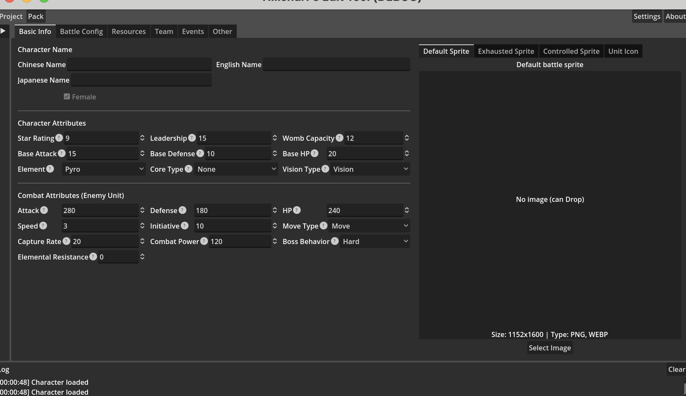

# 4_h1 基本信息

基本信息标签页分为左右两个区域：

## 左侧：属性表单

表单分为三组：

**名称**

- 中文名 / 英文名 / 日文名

**角色属性**

| 字段 | 说明 |
|------|------|
| 星级 | 角色星级，影响各类属性 |
| 领导力 | 作为我方单位时的领导力 |
| 子宫容量 | 影响单次产出的单位数 |
| 基础攻击 | 作为我方单位时的攻击力加成 |
| 基础防御 | 作为我方单位时的防御力加成 |
| 基础生命 | 作为我方单位时的生命值加成 |
| 元素 | 角色的元素属性 |
| 核心类型 | 角色的核心类型 |
| 神之眼 | 角色的神之眼类型 |

**战斗属性**

| 字段 | 说明 |
|------|------|
| 攻击力 | 敌方单位的攻击力 |
| 防御力 | 敌方单位的防御力 |
| 生命值 | 敌方单位的生命值 |
| 速度 | 影响战斗中的移动范围 |
| 先手值 | 影响战斗中的出手顺序 |
| 移动方式 | 单位在战场上的移动方式 |
| 捕获率 | 单位基础捕获率 |
| 战力 | 基础战斗力，用于自动战斗评估 |
| Boss 行为 | 作为敌方单位时的 AI 行为模式 |
| 元素抗性 | 自身所属元素的抗性 |

## 右侧：战斗图标预览

显示当前角色的战斗图标，支持多个标签页切换不同状态的图标（默认、疲劳、特殊状态等）。

导入图片的方式：

- 点击预览区域选择文件
- 直接将图片文件拖拽到预览区域

导入后，编辑器会自动生成不同尺寸的变体图片。
