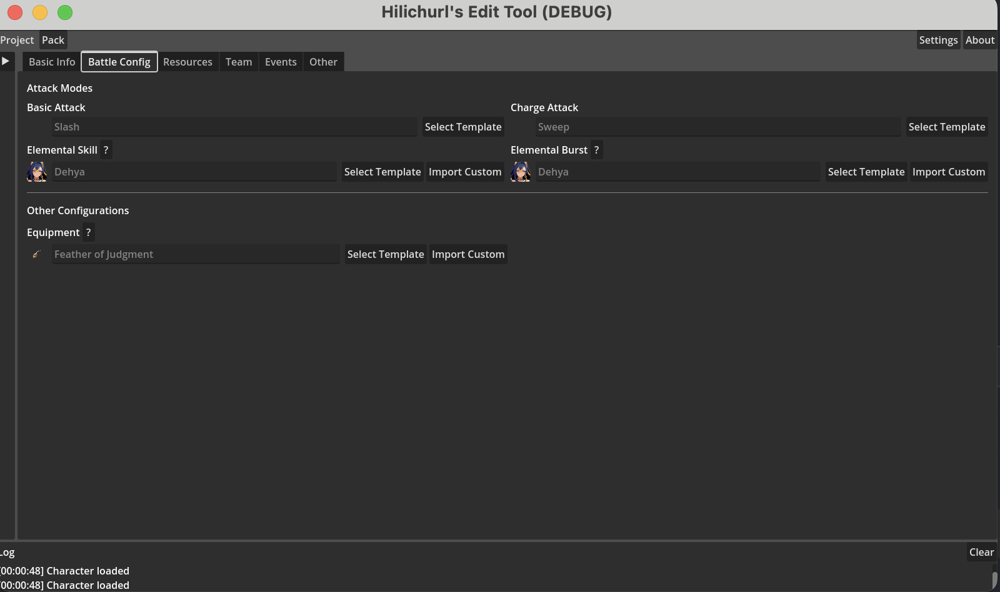

# 4_h2 Battle Config

The Battle Config tab is where you choose the character's attack modes and equipment.

## Attack Modes (`editor.section_attack_mode`)

| Field | Description |
|-------|-------------|
| Basic Attack (`editor.basic`) | Character's basic attack mode |
| Charge Attack (`editor.charge`) | Character's charge attack mode |
| Elemental Skill (`editor.skill`) | Character's elemental skill |
| Elemental Burst (`editor.burst`) | Character's elemental burst |

Click **Select Template** (`editor.select_template`) to pick from templates in a dialog.

## Other Configurations (`editor.section_other_config`)

| Field | Description |
|-------|-------------|
| Equipment (`editor.item`) | Character's equipped items |

## Custom import

Elemental Skill, Elemental Burst, and Equipment support custom import—if existing templates don't meet your needs, you can import your own scripts. Click **Import Custom** (`editor.import_custom`) to select a file. The **?** button next to it shows the custom authoring guide.
