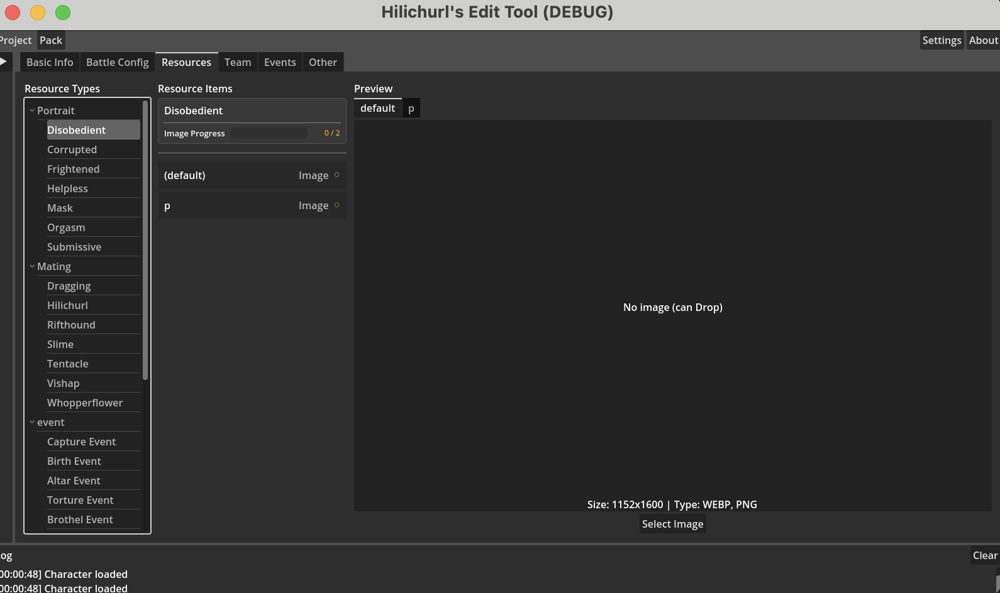

# 4_h3 リソース

リソースタブでは、キャラクターの画像と音声を管理します。3カラムレイアウトです。

- **左：カテゴリーツリー** — カテゴリー別のリソースグループ  
- **中：リソースリスト** — 選択したカテゴリー内の全項目と完了状態  
- **右：プレビュー** — 選択したリソースをプレビュー。バリアント表示に対応  

プレビューエリアにファイルをドラッグしてリソースをインポートできます。

**必要なリソースのみ設定すればOKです。すべて埋める必要はありません。**

## リソースカテゴリー

| カテゴリー | 説明 | 形式 |
|-----------|------|------|
| 立ち絵（`resource.portrait`） | キャラクター立ち絵、複数の表情状態を含む | PNG |
| 交配アニメ（`resource.mating`） | 交配シーン画像、引きずりと各種モンスタータイプを含む | PNG |
| CG（`resource.cg`） | ストーリーイベントCG画像 | PNG |
| 拷問/特殊（`resource.torture`） | 拷問関連画像 | PNG |
| ボイス（`resource.voice`） | キャラクター戦闘ボイス | OGG |

## 立ち絵の状態

立ち絵には次の表情状態があります。各状態に複数のバリアントを持てます。

| English | 中文 |
|---------|------|
| Disobedient（`resource.state.angry`） | 拒絶 |
| Submissive（`resource.state.sad`） | 恭順 |
| Frightened（`resource.state.frightened`） | 恐怖 |
| Corrupted（`resource.state.corrupted`） | 淫乱 |
| Helpless（`resource.state.helpless`） | 絶望 |
| Mask（`resource.state.mask`） | マスク |
| Orgasm（`resource.state.orgasm`） | 絶頂 |
| Sad | 悲しみ |

## 交配アニメの状態

| 状態 | 説明 |
|------|------|
| Dragging（`resource.state.dragging`） | 引きずりアニメ |
| Hilichurl（`resource.monster.hilichurl`） | ヒルチャールシーン |
| Rifthound（`resource.monster.rifthound`） | 獣域ハウンドシーン |
| Slime（`resource.monster.slime`） | スライムシーン |
| Tentacle（`resource.monster.tentacle`） | 触手シーン |
| Vishap（`resource.monster.vishap`） | ヴィシャップシーン |
| Whopperflower（`resource.monster.whopperflower`） | トリックフラワーシーン |

## イベントCG

| 番号 | 説明 |
|------|------|
| 01 | 捕縛イベント（`resource.cg.01`） |
| 03 | 出產イベント（`resource.cg.03`） |
| 04 | 悪堕ち(祭壇)イベント（`resource.cg.04`） |
| 05 | 悪堕ち(調教)イベント（`resource.cg.05`） |
| 07 | 売春宿イベント（`resource.cg.07`） |
| 10 | 共通イベント（`resource.cg.10`） |

## ボイス

| タイプ | 説明 |
|--------|------|
| Chosen（`resource.voice.chosen`） | 選択時のボイス |
| DEFEATED（`resource.voice.defeated`） | 全滅時のボイス |
| Retreat（`resource.voice.retreat`） | 撤退時のボイス |
| Elemental Burst（`resource.voice.elemental_burst`） | 元素爆発使用時のボイス |
| Elemental Skill（`resource.voice.elemental_skill`） | 元素スキル使用時のボイス |
| Heavy Attack（`resource.voice.heavy_attack`） | 重撃時のボイス |
| Mid Attack（`resource.voice.mid_attack`） | 中撃時のボイス |
| Light Attack（`resource.voice.light_attack`） | 軽撃時のボイス |

## 自動生成

立ち絵と交配アニメカテゴリーでは、大きな画像をインポートすると、対応するサムネイルが自動生成されます（Animated フォルダに保存）。元の大きな画像をインポートするだけで、サムネイルは手動で作る必要がありません。
