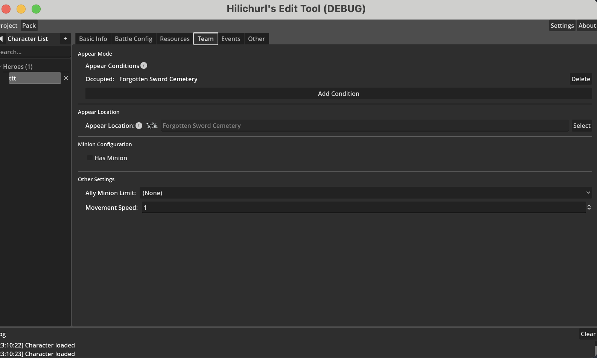

# 4_h4 登场方式

登场方式标签页包含四个配置区域：

## 出场条件

设定角色在游戏中出现所需满足的条件。可以添加多个条件，角色会在所有条件都满足时出现。

新建角色默认条件为"占领无名剑冢"。

### 条件类型

每个条件由"类型"和"目标"两部分组成。点击「添加条件」按钮后，先在左侧选择条件类型，再在右侧选择具体目标。

| 条件类型 | 目标选择范围 | 含义 |
|---------|-------------|------|
| 出现（Appeared） | 角色 | 指定角色已出现 |
| 击败（Defeated） | 角色 | 指定角色已被击败 |
| 逃脱（Escaped） | 角色 | 指定角色已逃脱 |
| 占领（Occupied） | 据点 | 指定据点已被占领 |
| 攻击（Attacked） | 据点 | 指定据点已被攻击 |
| 破坏（Destructed） | 建筑 | 指定建筑已被破坏 |
| 持有物品（Has Item） | 物品 | 持有指定物品 |

每种条件类型只能添加一个。如果重复添加同类型条件，新条件会覆盖旧条件。

> **注意**：条件类型和目标列表是从游戏数据中自动提取的，可能不完全准确。如果遇到某个条件在游戏中无法正常触发或报错，请及时反馈。

## 登场位置

从据点列表中选择角色的登场位置。

## 随从配置

配置角色作为敌方登场时携带的随从。

- **携带随从** —— 是否携带随从，勾选后显示以下选项
- **随从单位** —— 选择随从的单位
- **随从数量** —— 设定携带的随从数量

## 其他设置

- **己方随从限制** —— 角色作为我方单位时，己方随从的移动类型限制
- **移动速度** —— 角色的移动速度
