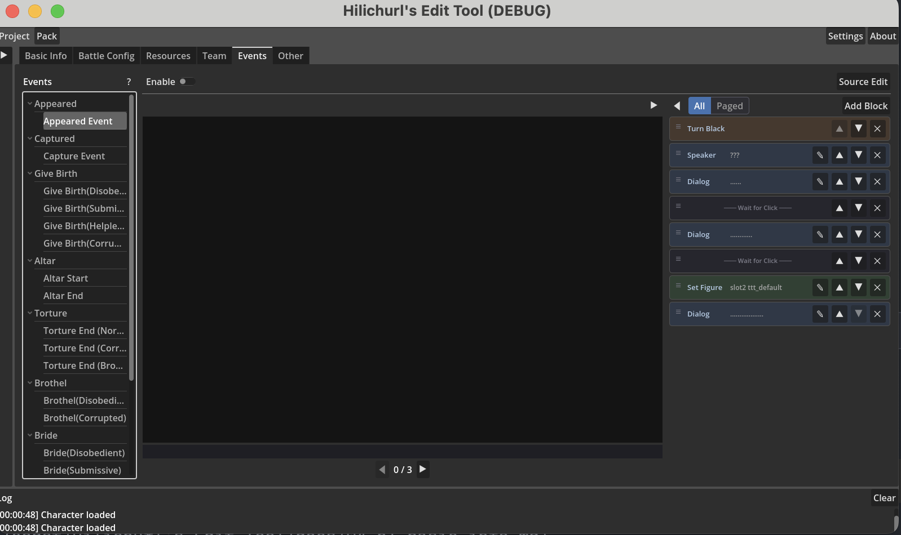
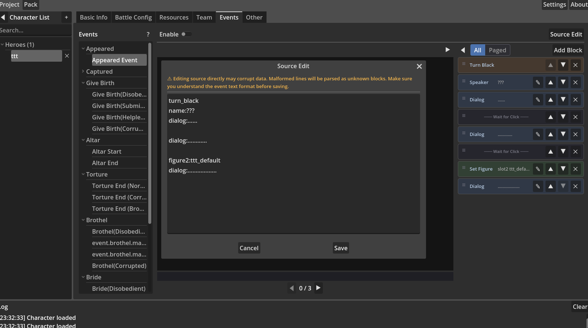

# 4_h5 イベントエディタ



イベントエディタでキャラクターのストーリーイベントを構成します。各イベントは一連の「ブロック」で構成され、ゲーム内で順番に実行されます。

## UI レイアウト

イベントエディタは左右2つのエリアに分かれています。

- **左：イベントナビゲーションツリー** — カテゴリー別に編集可能なイベントを一覧表示  
- **右：編集＆プレビューエリア** — プレビューパネルとブロック編集パネルが左右に並ぶ  

プレビューと編集パネルの間の区切りをドラッグして幅を調整できます。

## イベントナビゲーション

左側のツリーはイベントをカテゴリー別に整理します。

一部のイベントはキャラクターの状態別に複数のサブイベントがあります。

| コード | 状態 |
|--------|------|
| a | 拒絶（`event_editor.status_angry`） |
| b | 恭順（`event_editor.status_sad`） |
| c | 絶望（`event_editor.status_helpless`） |
| d | 淫乱（`event_editor.status_corrupted`） |

| カテゴリー | 含まれるイベント |
|-----------|-----------------|
| 登場（`event.appeared`） | 登場イベント |
| 捕縛（`event.captured`） | 捕縛イベント |
| 出產（`event.give_birth`） | a / b / c / d 4状態 |
| 悪堕ち(祭壇)（`event.altar`） | 1=開始 / 2=終了 |
| 悪堕ち(調教)（`event.torture`） | 通常 / 淫乱 / 壊れた |
| 売春宿（`event.brothel`） | a / b / c / d 4状態（下記特記参照） |
| 花嫁（`event.wedding`） | a / b / c / d 4状態 |
| 花嫁SP（`event.wedding2`） | a / b / c / d 4状態 |

イベント名をクリックして編集を開きます。

### イベント特記事項

**基礎ブロック**

ほとんどのイベントには、テンプレートから自動生成されたプリセットの基礎ブロック（CG、Background など）が含まれます。これらは削除できませんが移動できます。

**前提リソース（frontload）**

Appeared 以外のすべてのイベントには対応する CG 画像が必要です。各イベントで必要な CG 番号は異なります（例：Capture は 01 シリーズ、Give Birth は 03 シリーズなど）。必要な CG が不足している場合、ツールバーに ⚠ 警告が表示されます。警告にマウスを置くと、不足しているファイル名が表示されます。

**追加項目**

一部のイベントカテゴリー（Wedding2/花嫁SP など）には追加情報が必要です。イベントツリーで、これらのカテゴリー名の横に ✎ 編集ボタンが表示されます。

現在サポートされている追加項目：**称号設定**—このキャラクターを倒した後にプレイヤーが獲得する称号名です。3言語（中国語/英語/日本語）の翻訳を入力します。未設定の場合、カテゴリーに ⚠ 表示が出ます。このカテゴリーのイベントを有効にすると、エクスポート時に称号の翻訳がゲームデータに書き込まれます。

**売春宿イベント特記**

売春宿には絶望(c)、淫乱(d)、マスク状態のキャラクターのみ配置可能です。マスク状態は特殊で、実行時に現在の実際の状態のロジックに従います（拒絶/恭順/絶望/淫乱すべて可能）。そのため編集権限は保持され、最低でも淫乱(d)のみ編集できます。

### イベントの有効/無効

各イベントの右上に **Enable**（`event.enable`）トグルがあります。有効にしたイベントのみエクスポートに含まれます。

### リソース警告

一部のイベントには対応する CG 画像が必要です。必要な画像が不足している場合、イベント名の横に **⚠** 警告が表示されます。リソースタブで対応する CG をインポートすると警告が消えます。

## ブロックリスト

右側パネルには現在のイベントのすべてのブロックが色付きカードで表示されます。

### 表示モード

2つの表示モード、上部ボタンで切り替え：

- **すべて**（`event_editor.view_all`）— イベント内のすべてのブロックを表示  
- **ページ**（`event_editor.view_paged`）—「クリック待ち」ブロックをページ境界として使用。プレビューパネルと編集パネルは独立したページナビゲーション

### ブロック操作

- **ブロック追加**（`event_editor.add_block`）— クリックしてメニューからブロックタイプを選択  
- **ブロック編集** — ブロックカードをクリックして編集ウィンドウを開く  
- **ブロック削除** — ブロックカード右上の ✕ ボタンをクリック  
- **ドラッグ並び替え** — カード左側の ≡ ハンドルを持って上下にドラッグ  
- **ソース編集** — 下記[ソース編集](#source-editing)参照

イベントテンプレートの基礎ブロックは削除できませんが移動できます。

## ブロックタイプ

18種類のブロックタイプ、いくつかのカテゴリーに分類：

### セリフ

| ブロックタイプ | ゲームコマンド | 用途 |
|--------------|--------------|------|
| 話者（`event_editor.type_name`） | `name:` | 現在の話者名を設定、空白でクリア |
| セリフ（`event_editor.type_dialog`） | `dialog:` | セリフボックステキストを表示 |

### ビジュアル

| ブロックタイプ | ゲームコマンド | 用途 |
|--------------|--------------|------|
| 背景（`event_editor.type_background`） | `background:` | 背景画像を切り替え |
| CG（`event_editor.type_cg`） | `CG:` | CG画像を表示/クリア（背景の上にレイヤー） |
| 立ち絵設定（`event_editor.type_figure`） | `figure1:` / `figure2:` | 右側(1)または左側(2)に立ち絵を配置、空白で現在のキャラクターを表示 |
| 立ち絵非表示（`event_editor.type_hide_figure`） | `hide_figure1:` / `hide_figure2:` | 指定位置の立ち絵を削除 |
| 暗転（`event_editor.type_turn_black`） | `turn_black:` | 次の背景ブロックまで黒画面マスク |
| 振動（`event_editor.type_shake`） | `shake:` / `shake_x:` | 画面振動、垂直または水平、強度調整可 |

### オーディオ

| ブロックタイプ | ゲームコマンド | 用途 |
|--------------|--------------|------|
| BGM（`event_editor.type_bgm`） | `bgm:` | BGM切り替え、空白で停止 |
| サウンド再生（`event_editor.type_sound`） | `sound:` | ワンショット効果音再生、音量調整可 |
| ボイス（`event_editor.type_voice`） | `voice:` | カスタムボイスファイル再生（Voice/ ディレクトリ）、音量調整可 |
| プリセットボイス（`event_editor.type_preset_voice`） | `preset_voice:` | プリセットボイスキーワード再生、音量調整可 |
| ループボイス（`event_editor.type_cont_voice`） | `continue_voice:` | ボイスループ開始、音量と速度調整可 |
| ループボイス停止（`event_editor.type_cont_voice_end`） | `continue_voice_end:` | ループボイス停止 |
| ループサウンド（`event_editor.type_cont_sound`） | `continue_sound:` | 効果音ループ開始、音量と速度調整可 |
| ループサウンド停止（`event_editor.type_cont_sound_end`） | `continue_sound_end:` | ループサウンド停止 |

ボイスは主にキャラクターボイスで、事前にインポートが必要です。現在のツール実装では、voice と preset_voice は本質的に同じです。

### コントロール

| ブロックタイプ | ゲームコマンド | 用途 |
|--------------|--------------|------|
| ディレイ（`event_editor.type_auto`） | `auto:` | 指定秒数待ってから自動進行、プレイヤークリックでスキップ可 |
| クリック待ち（`event_editor.type_pause`） | （空行） | プレイヤークリックで一時停止、ページ境界としても機能 |

> **注意**：ゲームエンジンは `hide_background`、`signal`、`icon`/`end_icon` などもサポートしますが、エディタにはまだ対応するブロックタイプがありません。これらのコマンドを使用するには、ソース編集モードで手動入力してください。

## ブロック内容の編集

ブロックカードをクリックすると編集ウィンドウが開きます。ブロックタイプによって内容が異なります。

- **テキスト**（話者/セリフ）— 入力ボックスまたは複数行テキストボックス  
- **画像**（背景/CG/立ち絵）— 画像ピッカー、左リスト、右プレビュー、インポート対応  
- **オーディオ**（BGM/サウンド/ボイス）— オーディオピッカー、検索、プレビュー、インポート対応  
- **数値**（音量/速度/振動強度）— 数値スライダー  
- **オプション**（立ち絵位置/振動方向）— ドロップダウンメニュー  

## プレビューパネル

中央のプレビューパネルはイベント効果をリアルタイムでレンダリングします。

- 背景と CG のレイヤー表示  
- 左右両側の立ち絵  
- セリフボックス（話者名 + セリフテキスト）  
- 現在の BGM 名  
- 黒画面マスク効果  

ページモードでは、プレビューは現在のページで状態を累積します。前のページで設定された背景、立ち絵などは後続ページに引き継がれます。

## リソース元

イベント内の画像とオーディオは次の優先順位で検索されます。

1. **キャラクターディレクトリ** — 現在のキャラクターの Figure/CG フォルダ  
2. **プロジェクト共有** — プロジェクトの event_assets ディレクトリ（全キャラクター共有）  
3. **グローバルプリセット** — options パッケージ内のプリセットリソース  

編集ウィンドウのインポートボタンからインポートしたリソースは、プロジェクト共有ディレクトリに自動保存されます。

## ソース編集 {#source-editing}

ツールバーの **Source Edit**（`event.source_edit`）をクリックすると、テキスト編集ウィンドウが開き、イベントの生コマンド形式を直接編集できます。



### なぜソース編集が必要か

現在のバージョンでは、CG と背景のブロックは基礎ブロックとしてマークされており、ビジュアルインターフェースでは編集または削除できません（設計上の制限、将来のバージョンで改善予定）。これらをカスタマイズする必要がある場合、現時点ではソース編集が唯一の方法です。

また、ゲームエンジンはエディタがまだビジュアルサポートしていない一部のコマンド（`hide_background`、`signal`、`icon`/`end_icon` など）をサポートしています。ソース編集で手動入力できます。

### 形式

1行1コマンド、形式は `コマンド:パラメータ`。空行はクリック待ち（ページ区切り）です。

```
background:bg_forest.webp
name:Alice
dialog:ここはどこ...

CG:anna_01_1.webp
shake:5
name:Alice
dialog:何が起こった?!

```

- `name:` は話者設定、`dialog:` はセリフテキスト表示、それぞれ独立したコマンド  
- 複数パラメータを持つコマンドはスペース区切りのキーバリューペア：`sound:sound=slash_1 vol=0`  
- テンプレート変数サポート：`{{heroine}}` はゲーム内でキャラクタータイプ名に置換されます  

### 重要事項

- ソース編集は生データを直接操作します。形式エラーでイベントが実行できなくなる可能性があります  
- ソースで参照されるリソースファイルは存在を確認する必要があります。エディタは自動インポートしません。リソースディレクトリ：
  - 背景：`{プロジェクト}/event_assets/Background/` または options プリセット  
  - 立ち絵：`characters/{キャラクターID}/Figure/` または `{プロジェクト}/event_assets/Figure/`  
  - CG：`characters/{キャラクターID}/CG/`  
  - ボイス：`characters/{キャラクターID}/Voice/` または `{プロジェクト}/event_assets/Voice/`  
  - BGM/サウンド：options パッケージから（`audio/bgm/`、`audio/sound/`）  
- 保存後、ビジュアルインターフェースは同期更新されます。プレビューパネルで効果を確認できます
