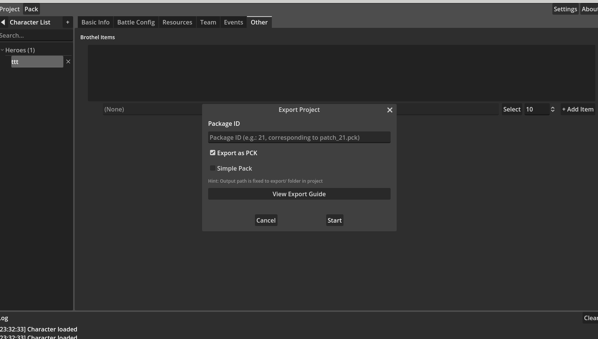

# 第5章：エクスポートとパック

> **警告：エクスポートのたびに `export/` ディレクトリが完全にクリアされます！** エクスポートディレクトリで手動変更を行った場合は、先に別の場所にファイルをコピーしてください。そうしないと永久に失われます。

キャラクターデータの編集が完了したら、ゲームが読み込める形式にエクスポートします。メインウィンドウ上部の **Pack**（`menu.pack`）をクリックしてエクスポートダイアログを開きます。

## エクスポート設定

| 設定項目 | 説明 |
|---------|------|
| パッケージID（`editor.export_id`） | エクスポートパッケージの識別子（例：`21`）、出力ファイル名 `patch_21.pck` に対応 |
| PCKとしてエクスポート（`editor.export_as_pck`） | リソースを単一PCKファイルにパックするかどうか。オフにすると散在リソースファイルを出力 |
| シンプルパック（`editor.export_simple_pack`） | PCKオン時のみ使用可、より小さいPCKを生成（詳細は下記参照） |

出力パスはプロジェクトディレクトリ下の `export/` フォルダに固定されています。

ダイアログは前回の設定を記憶し、次回開いたときに自動復元します。**エクスポートガイドを表示**（`editor.export_guide`）をクリックすると詳細な手順が表示されます。

## エクスポート流れ

エクスポートは次の段階を自動実行します（**注意：最初に `export/` ディレクトリをクリアします**）：

1. **リソース統合** — すべてのキャラクターディレクトリをスキャンし、リソースファイルを出力ディレクトリにコピー、Install スクリプトを生成  
2. **プロジェクト設定生成** — Godot プロジェクト設定ファイルを生成（PCK パックに必要）  
3. **PCK パック** — Godot エンジンを呼び出してリソースを `.pck` ファイルにパック（PCK オン時のみ）  
4. **イベントファイル出力** — 有効化されたすべてのイベントを個別の JSON ファイルとしてエクスポート  

## パックモード

### PCK モード（デフォルト）

すべてのリソースを単一の `patch_{id}.pck` ファイルにパック、加えて Install スクリプトとイベントファイルを出力します。

### シンプルパックモード

より小さい PCK ファイルを生成し、スクリプトとボイスリソースのみを含みます。画像などの大きなリソースファイルは別途出力され、PCK には含まれません。PCK サイズを小さくする必要があるシナリオに適しています。

### 非 PCK モード

パックせず、散在リソースフォルダ + Install スクリプト + イベントファイルを直接出力します。

## 出力内容

エクスポート完了後、`export/` ディレクトリには次が含まれます。

| 内容 | 説明 |
|------|------|
| `patch_{id}.pck` | パック済みリソースファイル（PCKモードのみ） |
| `Install_{id}.gd` | インストールスクリプト、ゲーム読み込み時に実行されキャラクターデータを登録 |
| `Event/*.json` | 有効化されたイベントファイル、各イベント1ファイル |
| リソースフォルダ | Unit/Figure/CG/Voice などのリソースディレクトリ |

## 前提条件

- PCK エクスポートには Godot 実行ファイルパスの設定が必要（**設定**で設定）  
- 少なくとも1つのキャラクターと保存済みデータが必要
