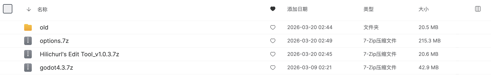

# 第八章：附录

## 下载 {: #downloads }

工具包下载地址：[MEGA](https://mega.nz/folder/3qRU0Z6Y#zc6ftC1U3HUCB7ZWve_UbA)

| 文件 | 说明 |
|------|------|
| `Hilichurl's Edit Tool_v*.7z` | 编辑器本体 |
| `options.7z` | Options 配置包（解压后在设置中指定目录） |
| `godot4.3.7z` | Godot 引擎（导出 PCK 打包时需要） |
| `old` | 老版本工具位置，用作大版本更新出错时回退 |

## 已知限制

当前版本存在以下限制，后续版本会逐步优化：

- 事件类别和子事件为预设，不可自建
- CG 和背景块在可视化界面中不可编辑（可通过[源码编辑](04_h5_event_editor.md#source-editing)绕过）
- 部分数据翻译不完整，未翻译的项显示原始英文 ID
- 出场条件数据从游戏中自动提取，可能不完全准确
- 子英雄功能
- 自定选项
- 适配新世界（至少可以编辑）

## 反馈

如果遇到 bug、数据异常或有功能建议，请到 Discord 反馈。

## 常见问题

### 启动时弹出设置对话框？

首次启动或设置文件丢失时会自动弹出。需要配置 Options 目录和 Godot 可执行文件路径。详见[快速开始](02_quick_start.md)。

### 导出时提示 Godot 路径未配置？

在设置中指定 Godot 可执行文件路径。如果暂时不需要 PCK 打包，可以关闭「打包为 PCK」选项直接导出散装文件。

### 角色 ID 填错了怎么办？

角色 ID 创建后无法修改。如需更改，需要新建角色并重新配置数据。

### 事件的 CG/背景无法编辑？

当前版本中 CG 和背景被标记为基础块，不可在可视化界面中编辑。可通过[源码编辑](04_h5_event_editor.md#source-editing)修改。

### 导出目录的文件消失了？

每次导出前会自动清空 `export/` 目录。如果需要保留手动修改的文件，请在导出前复制到其他位置。

### 切换语言后部分选项仍显示英文？

数据翻译可能不完整，未翻译的项会显示原始英文 ID。

### 出场条件在游戏中不生效？

条件数据是从游戏中自动提取的，可能不完全准确。如遇问题请反馈。

## 术语表

| 术语 | 说明 |
|------|------|
| Options | 编辑器的基础数据配置包，包含英雄模板、物品、音效等游戏数据 |
| PCK | Godot 资源包格式，将多个文件打包为单个文件 |
| Install 脚本 | 导出时生成的 GDScript 文件，游戏加载时执行以注册角色数据 |
| 块（Block） | 事件中的最小指令单元，如一条对话、一个背景切换 |
| 分页 | 事件中的「等待点击」块，将事件分为多页，游戏中需玩家点击继续 |
| 基础块 | 事件模板预设的块，不可添加/编辑/删除，仅可移动 |
| 差分 | 同一张图片的不同变体（如不同表情状态），编辑器可自动生成缩略图 |
| event_assets | 项目级共享资源目录，所有角色可共用其中的背景、立绘、语音 |
| 源码编辑 | 以文本格式直接编辑事件块指令，可绕过可视化界面的限制 |
